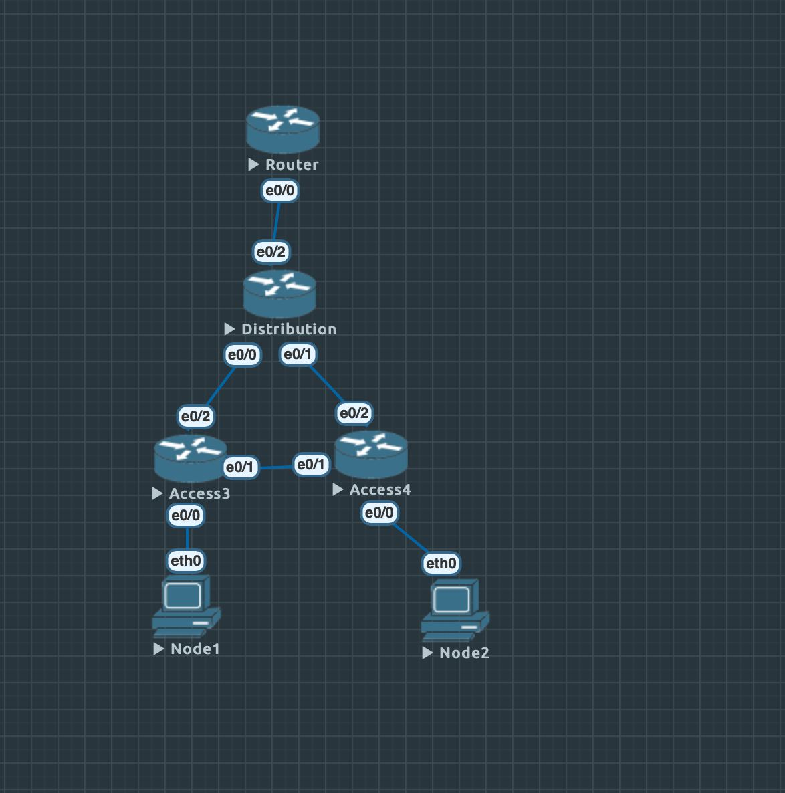
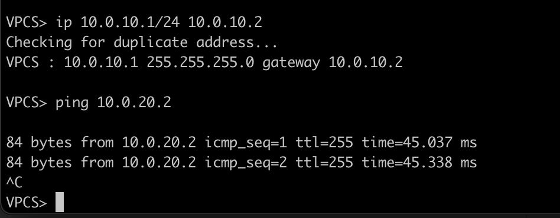
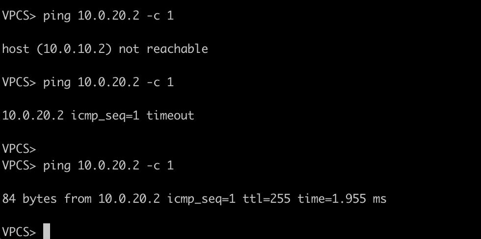
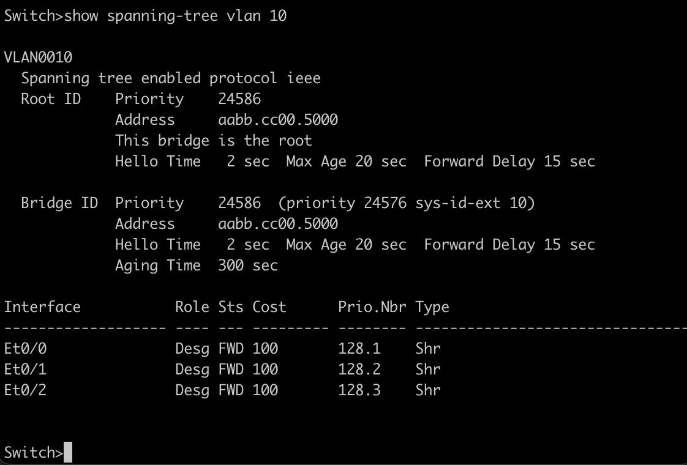
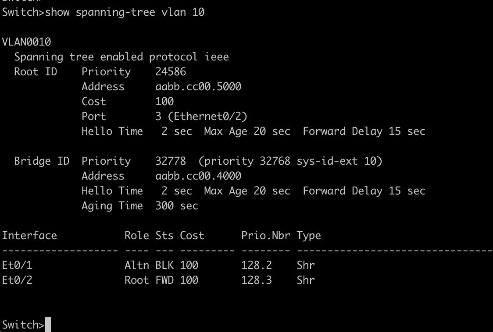
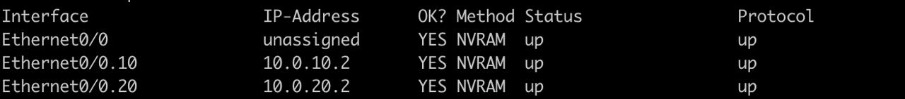

Все конфиги в config. Также есть unl. ip на машины выдаются стандартно.

Выглядит как-то вот так:

Пинги работают. В обычном режиме:

И после перезагрузки:

Вот так выглядит конфигурация для одного vlan с коммутатора уровня распределений (С принадлежащего vlan коммутатору аналогично):

Тот же vlan, но с "противоположного" коммутатора уровня доступа:

Ну и сам маршрутизатор:

