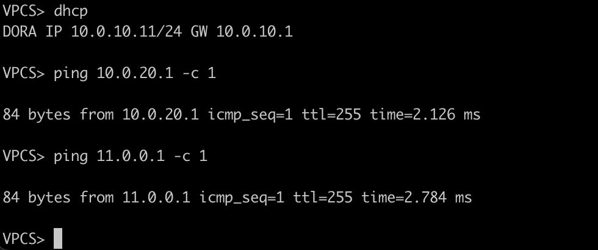

Топология:

Так же есть unl и конфиги, но почти ничего не отличается от предыдущей дз, только router1 чуть-чуть апгрейднут. Для router2 - банально. 
Так же ip чуть по-другому задается. Пинги работают и в клиентов и в маршрутизатор:

